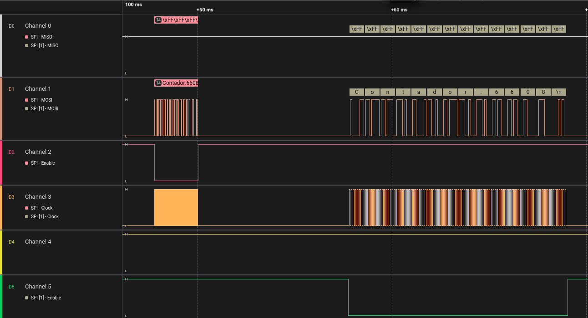

# Ejemplo de uso de SPI en modo Master

Este proyecto muestra cómo configurar el **ESP32** en modo **SPI Master** para comunicarse con dos dispositivos esclavos ficticios. Se utilizan señales simuladas para representar la interacción entre el master y los esclavos, lo que permite visualizar la comunicación mediante un analizador lógico.

---

## 📌 Objetivos

- Configurar el ESP32 como dispositivo maestro SPI.
- Simular dos esclavos SPI.
- Visualizar la comunicación SPI con un analizador lógico.
- Comprender el uso de pines `MOSI`, `MISO`, `SCLK` y `CS`.

---

## 🧰 Requisitos

- ESP32 (cualquier modelo compatible)
- Analizador lógico (opcional pero recomendado)

---


## ⚙️ Configuración de pines

| Función | Pin ESP32 (ejemplo) |
|--------|----------------------|
| MOSI   | GPIO 25              |
| MISO   | GPIO 23              |
| SCLK   | GPIO 19              |
| CS1    | GPIO 22              |
| CS2    | GPIO 21              |


> ⚠️ Asegurate de modificar los pines si estás usando otro modelo de ESP32.

---

## 📸 Capturas del Analizador Lógico

A continuación, se muestran ejemplos de señales SPI capturadas con un analizador lógico. Estas capturas permiten observar la secuencia de bits y la activación de los pines `CS`.





### 🖼️ Configuracion de dispositivos

Configuracion del dispositivo 1:
```c

    spi_device_interface_config_t dev1_config ={
        .clock_speed_hz = 50000,
        .mode = 0,
        .clock_source = SPI_CLK_SRC_DEFAULT, //
        .spics_io_num = SPI_CS_DEV1,
        .queue_size = 10,
        .pre_cb = tr_pre,
        .post_cb=tr_pos,
        .flags = SPI_DEVICE_NO_DUMMY
    };

```
### Descargar LVGL en su proyecto

Para instalar LVGL en nuestro proyecto usaremos el siguiente componente de ESP: [lvgl/lvgl](https://components.espressif.com/components/lvgl/lvgl). Para instalarlo, debemos abrir una terminal ESP-IDF y ejecutar:

```bash
idf.py add-dependency "lvgl/lvgl^9.2.2"
```
Luego de compilar nuevamente se descargara e instalara LVGL En su proyecto.


### Instalar LVGL en su proyecto
Para instalar LVGL en su programa debera seguir los pasos que se indican aqui: [Documentacion LVGL](https://docs.lvgl.io/master/details/integration/adding-lvgl-to-your-project/index.html). 

En este ejemplo, la tarea display_task implementa la conexión de los controladores de display y time de LVGL:
```c
#define MAX(a,b) ((a) > (b) ? (a) : (b))
#define BYTES_PER_PIXEL (LV_COLOR_FORMAT_GET_SIZE(LV_COLOR_FORMAT_RGB565)) 
#define BUFF_SIZE (128 * 128 * BYTES_PER_PIXEL)

lv_display_t* display1;

uint32_t getTime(){
    uint32_t ret = xTaskGetTickCount();
    return ret;
}

void display_task(void *pvParameter){
    ST7735_Init();

    void *buf_1 = spi_bus_dma_memory_alloc(SPI_ST7735, BUFF_SIZE, 0);
    assert(buf_1);
    void *buf_2 = spi_bus_dma_memory_alloc(SPI_ST7735, BUFF_SIZE, 0);
    assert(buf_2);

    lv_init();
    lv_tick_set_cb(getTime);

    display1 = lv_display_create(128, 128);
    lv_display_set_buffers(display1, buf_1, buf_2, BUFF_SIZE, LV_DISPLAY_RENDER_MODE_FULL);
    lv_display_set_flush_cb(display1, my_flush_cb_with_DMA);

    create_ui();

    printf("Init program\n");

    uint32_t time_till_next_ms = 0;
    while (1) { 
        time_till_next_ms = lv_timer_handler();
        time_till_next_ms = MAX(time_till_next_ms, (1000 / CONFIG_FREERTOS_HZ));
        vTaskDelay(time_till_next_ms / portTICK_PERIOD_MS);
    }
}

```

Con la funcion flush que dibuja el display:
```c
 void my_flush_cb_with_DMA(lv_display_t *display, const lv_area_t *area, uint8_t *px_map)
{
    uint16_t *buf16 = (uint16_t *)px_map;  // Convertir el buffer a 16 bits para facilitar el acceso a cada píxel.
    uint32_t pixel_count = (area->y2 - area->y1 + 1) * (area->x2 - area->x1 + 1);

    for (uint32_t i = 0; i < pixel_count; i++) {
        uint16_t color = buf16[i];
        uint16_t inverted_color = ((color & 0xFF00) >> 8) | ((color & 0x00FF) << 8);
        buf16[i] = inverted_color;  // Actualizar el valor del píxel con el color invertido.
    }

    ST7735_DrawImage(0, 0, 128, 128, buf16);
    lv_display_flush_ready(display);
}


```

---

### Ejemplo en funcionamiento

<p align="center">
  
</p>

El ejemplo que se muestra en pantalla está implementado en el archivo `gui_simple`.  
Utiliza un dispositivo de entrada (*indev*), específicamente el botón `GPIO0` de la placa, para aumentar un contador.

---

